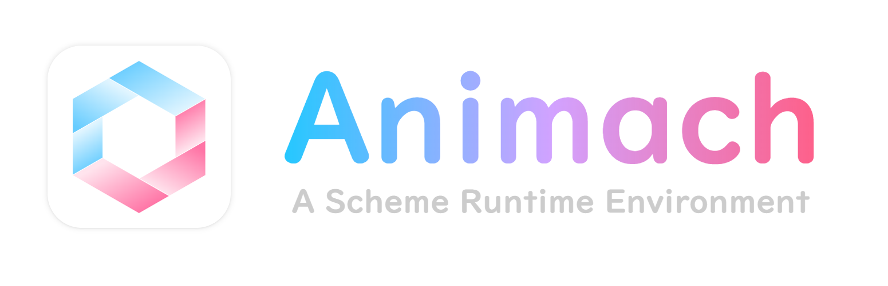
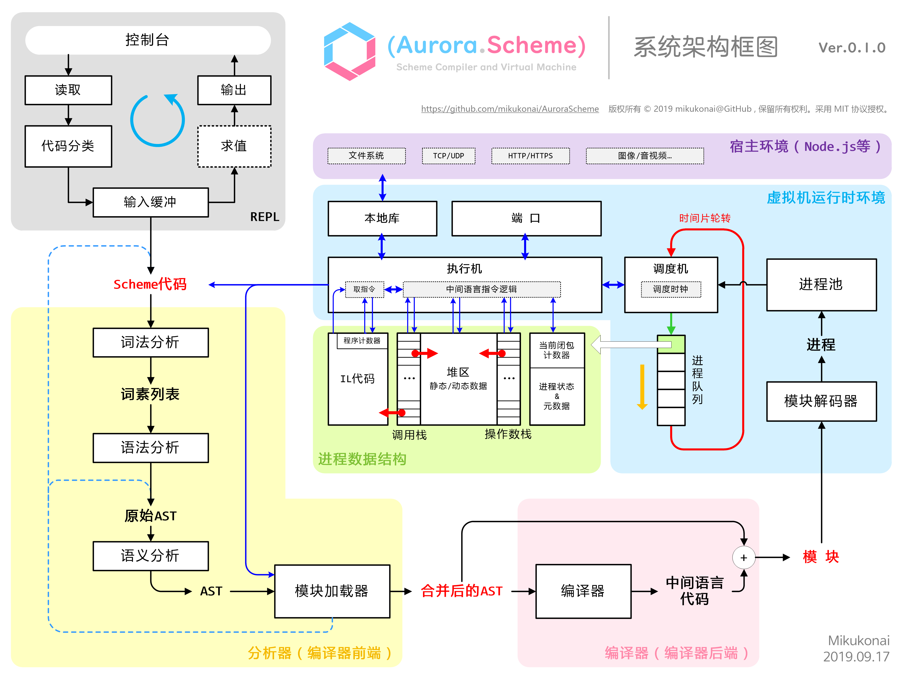

<p align="center"></p>

<h1 align="center">Animach / 灵机</h1>

 

版本 0.1.0

**Animach**是一款[Scheme](https://zh.wikipedia.org/wiki/Scheme)语言实现，能够将Scheme编译为中间语言代码，并且在虚拟机上执行中间语言代码。Animach基于Node.js开发，你可以使用JavaScript或者TypeScript编写“本地函数库”，以扩展Animach的功能。

## 使用方法

依赖项：

- Node.js v10+

执行以下命令，以启动Animach。

```
node ./source/AuroraScheme.js [Options] [Path]
```

启动选项：

- `repl`或留空：REPL（交互式解释器）
- `run [Path]`：执行`[Path]`处的Scheme源代码。
- `test`：执行测试用例。
- `debug`：启动调试服务器。

## 系统架构



## 特性

### Scheme语言特性

- 支持Scheme核心子集，包括作为值的函数、词法作用域和列表操作。
- 支持一等续延（continuation）和`call/cc`。
- 暂不支持卫生宏和模式匹配。
- 支持模块化开发，可检测并管理模块间依赖关系。

### 运行时系统

- Scheme代码将被编译为中间语言代码，在基于栈的虚拟机上运行。
- 基于标记-清除算法的垃圾回收。
- 支持虚拟机层次上的多进程。支持“端口”机制以实现进程间通信。

### 标准库和可扩展性

- 通过模块机制，提供基本的函数库，称为标准库。
- 提供类似于JNI的本地接口机制，可以使用TypeScript/JavaScript编写供Scheme代码调用的Native库，实现Animach与宿主环境（Node.js）的互操作，例如文件读写、网络收发等。
- 并**不打算完全严格遵守R<sup>5</sup>RS标准**，将按个人需要实现若干标准库函数。

## 计划实现的特性和功能

|Features|Priority|Status|
|----|-----|----|
|可视化调试工具|★★★|开发中|
|卫生宏和模式匹配|★★★|研究中|
|字符串模板和正则表达式|★★★|开发中|
|完善设计文档和用户手册|★★☆|开发中|
|数值类型塔（数学库）|★★☆|计划中|
|Canvas/SVG图形库|★★☆|计划中|
|R<sup>n</sup>RS尽量兼容|★☆☆|研究中|
|持续集成和自动化测试|★☆☆|计划中|
|较高级的编译优化|★☆☆|计划中|
|用C语言重构VM|★☆☆|开发中|
|自动CPST&自动柯里化|★☆☆|计划中|
|类型系统|★☆☆|计划中|

### 开发目标

- 通过持续改进，打造成一套个人自用的脚本工具。
- 学习研究目的。

## 示例

### 词法作用域

```scheme
(define free 100)

(define foo
  (lambda () free))

(define bar
  (lambda (free)
    (foo)))

(display (bar 200))
;; 输出100，而不是200
```

### 函数作为一等公民

```scheme
(define eval
  (lambda (f a b)
    (f a b)))

(display (eval * 30 40)) ; 1200
(display (eval (lambda (x y) (/ (+ x y) 2)) 30 40)) ; 35
```

### 列表操作

```scheme
(define hello '(hello aurora scheme))

(define iterate
  (lambda (lst)
    (if (null? lst)
        #f
        {
            (display (car lst))
            (iterate (cdr lst))
        })))

(iterate hello) ; hello aurora scheme
```

### 续延和`call/cc`

```scheme
;; Yin-yang puzzle
;; see https://en.wikipedia.org/wiki/Call-with-current-continuation

(((lambda (x) (begin (display "@") x)) (call/cc (lambda (k) k)))
 ((lambda (x) (begin (display "*") x)) (call/cc (lambda (k) k))))

; @*@**@***@**** ...
```

更多测试用例，请参考[`/testcase`](https://github.com/mikukonai/Animach/tree/master/testcase)。

## 形式语法（BNF表示）

```
    <SourceCode> ::= (lambda () <TERM>*) CRLF
          <Term> ::= <SList> | <Lambda> | <Quote> | <Unquote> | <Quasiquote> | <Symbol>
         <SList> ::= ( <SListSeq> )
      <SListSeq> ::= <Term> <SListSeq> | ε
        <Lambda> ::= ( lambda <ArgList> <Body> )
       <ArgList> ::= ( <ArgListSeq> )
    <ArgListSeq> ::= <ArgSymbol> <ArgListSeq> | ε
     <ArgSymbol> ::= <Symbol>
          <Body> ::= <BodyTerm> <Body_>
         <Body_> ::= <BodyTerm> <Body_> | ε
      <BodyTerm> ::= <Term>
         <Quote> ::= ' <QuoteTerm> | ( quote <QuoteTerm> )
       <Unquote> ::= , <UnquoteTerm> | ( unquote <QuoteTerm> )
    <Quasiquote> ::= ` <QuasiquoteTerm> | ( quasiquote <QuoteTerm> )
     <QuoteTerm> ::= <Term>
   <UnquoteTerm> ::= <Term>
<QuasiquoteTerm> ::= <Term>
        <Symbol> ::= SYMBOL
```

## 文档

- [设计笔记 / Design Notes](https://mikukonai.com/template.html?id=Animach%E8%AE%BE%E8%AE%A1%E7%AC%94%E8%AE%B0)
- [开发规约 / Development Regulation](https://github.com/mikukonai/Animach/blob/master/CONTRIBUTING.md)

## 关于名称

**Animach**，是自创的合成词，由拉丁语词汇Anima“灵魂”和Machina“机器”缩合而成，寓意“有灵魂的机器”。汉语名称为“**灵机**”，从“灵机一动”而来，也暗示本系统与图**灵机**的计算能力等价。

## 权利声明 / Licence

版权所有 &copy; 2019 Mikukonai@GitHub，保留所有权利。

采用MIT协议授权。

本系统为个人以学习和自用目的所创作的作品。作者不对此系统的质量作任何承诺，不保证提供任何形式的解释、维护或支持，也不为任何人使用此系统所造成的任何正面的或负面的后果负责。