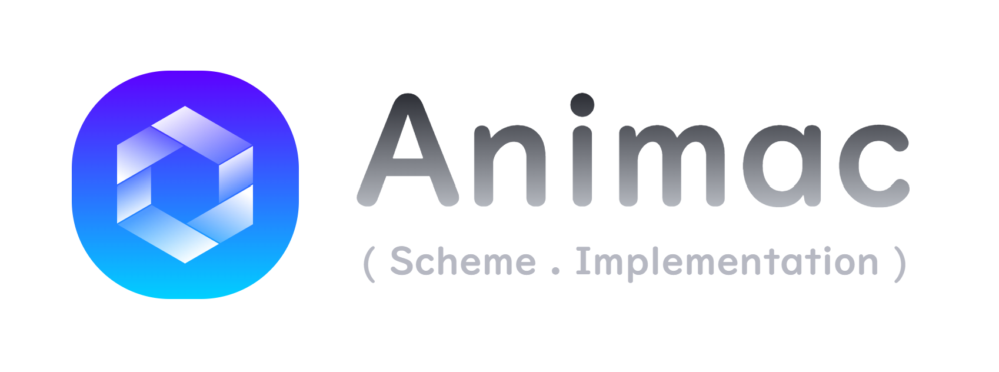
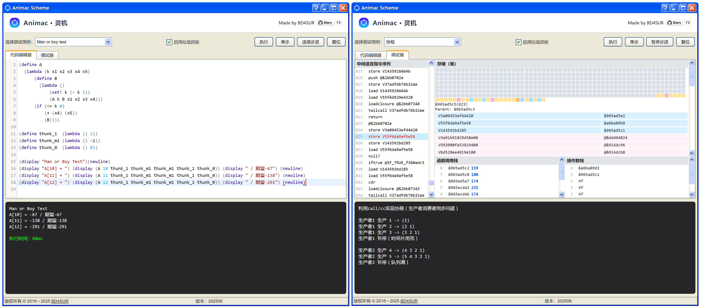
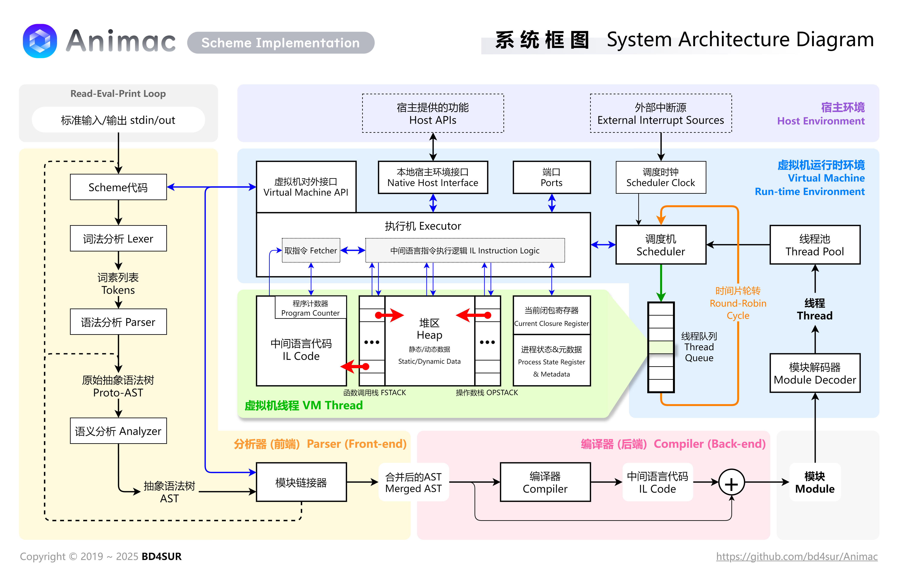

<p align="center"></p>

<h1 align="center">Animac · 灵机</h1>

**灵机 · Animac**是[Scheme](https://zh.wikipedia.org/wiki/Scheme)程序语言的一个实现。Animac将Scheme代码编译为中间语言代码，并且在虚拟机上执行。Animac不遵守R<sup>5</sup>RS标准。目前，Animac使用TypeScript开发，能够在Web浏览器和Node.js环境中运行。

▶ [立即体验](https://bd4sur.com/Animac) | [B站视频：调试器演示](https://www.bilibili.com/video/BV1xu4y1v7Ks)



## 特性

### Scheme语言特性

- **参考但是不遵守R<sup>5</sup>RS标准**。
- 支持Scheme核心子集，包括S表达式、第一等（first-class）的函数、词法作用域和列表操作等。
- 第一等的计算续体（continuation）和`call/cc`。
- 自动尾调用优化。
- 模块机制。

### 运行时系统



- 基于栈的虚拟机。Scheme代码被编译成中间语言代码，在虚拟机上执行。
- 虚拟机层次上的（用户态）多线程。
- 通过“端口”机制实现线程间通信。
- 自动垃圾回收（定期执行标记-清除）。

### 宿主接口和可扩展性

- 本地宿主接口机制。类似于JNI，用于实现Animac与宿主环境的互操作。

## 构建与使用

请先安装最新版Node.js和TypeScript编译器。

```
# 拉取仓库到本地
git clone https://github.com/bd4sur/Animac.git
cd Animac

# 构建
node build.js

# 执行
node build/animac-cli.js
```

也可以直接打开`index.html`在浏览器中使用。

## 用例

全部测试用例位于 [`test`](https://github.com/bd4sur/Animac/tree/master/test) 目录，主要包括3个用例集合和两个较大规模的单独的测试用例，详情如下。

- `big_int.scm`：基于卷积定理的大整数乘法。用于测试本地库和模块机制。
- `blink.scm`：通过文件操作控制GPIO，使LED闪烁。用于测试文件操作本地库。
- `brainfuck.scm`：Brainfuck解释器，其中所有循环和递归均通过Y组合子实现。
- `calculator.scm`：中缀表达式解析器。
- `calendar.scm`：输出月历。
- `church_encoding.scm`：λ演算的[Church编码](https://en.wikipedia.org/wiki/Church_encoding)。
- `coroutine.scm`：生产者消费者问题。通过`call/cc`实现“轻量级进程”机制，借助生产者消费者问题来演示单个虚拟机线程内实现关键资源的无锁并发操作。
- `deadlock.scm`：死锁模拟。基于虚拟机提供的多线程机制，模拟多个线程在访问共享资源（端口）时产生的死锁现象。
- `factorial.scm`：阶乘。用于测试语言核心和尾调用优化。
- `fft.scm`：快速傅里叶变换。用于测试数学本地库和语言核心。
- `generator.scm`：生成器演示。用于测试`call/cc`。
- `interpreter.scm`：在 *The Little Schemer* 书中实现的简单解释器。
- `list.scm`：各类列表操作和排序算法。
- `man_or_boy.scm`：Knuth提出的 [Man or Boy test](https://en.wikipedia.org/wiki/Man_or_boy_test)。用于测试词法作用域和闭包机制。
- `mlp.scm`：多层感知机模型的随机梯度下降训练和验证，用于解决[鸢尾花分类问题](https://en.wikipedia.org/wiki/Iris_flower_data_set)。
- `nano_llm_infer.scm`：[自制Nano语言模型](https://github.com/bd4sur/Nano)推理的纯Scheme实现。
- `nano_llm_infer_native.scm`：[自制Nano语言模型](https://github.com/bd4sur/Nano)推理的JavaScript本地库实现，通过本地接口机制供Scheme调用。
- `nano_llm_model.scm`：自制Nano语言模型权重，以base64格式的字符串形式存储在Scheme代码中。
- `quasiquote.scm`：测试“准引用列表”。
- `quicksort.scm`：快速排序。
- `quine.scm`：Quine（蒯因），自己输出自己的程序。
- `shudu.scm`：基于递归的数独求解算法。
- `sleepsort.scm`：睡眠排序，这是一种幽默的排序算法，旨在测试异步回调函数。
- `tls.scm`：在 *The Little Schemer* 书中实现的部分简单函数。
- `yinyang.scm`：[Yin-yang puzzle](https://en.wikipedia.org/wiki/Call-with-current-continuation#Examples)。
- `yinyang_cps.scm`：Yin-yang puzzle 的CPS实现。

**特性速览**

```scheme
;; 词法作用域

(define free 100)
(define foo (lambda () `(,free))) ; 准引用列表也是词法作用域的
(define bar (lambda (free) (foo)))
(bar 200) ; 输出(100)，而不是(200)


;; 函数作为第一等公民
(import List "list.scm") ; 引入列表操作高阶函数
(native Math) ; 声明使用数学本地库
(List.reduce '(1 2 3 4 5 6 7 8 9 10) + 0) ; 55
(List.map '(-2 -1 0 1 2) Math.abs)        ; (2 1 0 1 2)
(List.filter '(0 1 2 3)
             (lambda (x) (= 0 (% x 2))))  ; (0 2)


;; 循环结构（注意：循环体内并非如同JavaScript的块作用域）
(define sum 0)
(define i 1)
(while (<= i 100) {
  (set! sum (+ sum i))
  (set! i (+ i 1))
})
(display sum)  ;; 输出5050


;; Quine（自己输出自己的程序）
((lambda (x) (cons x (cons (cons quote (cons x '())) '()))) (quote (lambda (x) (cons x (cons (cons quote (cons x '())) '())))))


;; 续体和`call/cc`
;; Yin-yang puzzle
;; see https://en.wikipedia.org/wiki/Call-with-current-continuation
(((lambda (x) (begin (display "@") x)) (call/cc (lambda (k) k)))
 ((lambda (x) (begin (display "*") x)) (call/cc (lambda (k) k))))
; Output @*@**@***@**** ...
```

## 研发方针

Animac是什么？不是什么？

- **Animac是实验性的玩具系统，并非健壮可靠的软件产品**。Animac贯彻“代码即文档”的精神，将关键设计思想固化在人类可读、机器可执行的代码中。代码风格直白第一，不刻意采用所谓设计模式和最佳实践。
- **Animac是最小可用系统(MVP)**。Animac认同Scheme语言“小内涵、大外延”的极简主义哲学，不贪图大而全和酷炫的特性集合。Animac暂不关注安全、质量、性能等问题，除非感兴趣。
- **Animac是自持的、具体而微的系统**。Animac尽可能减少任何外部依赖，尽量不使用第三方库。Animac希望、但是不尝试实现[语言的自举](https://zh.wikipedia.org/wiki/%E8%87%AA%E4%B8%BE_(%E7%BC%96%E8%AF%91%E5%99%A8))。

特性规划：

|特性|优先级|状态|
|----|-----|----|
|数学库和CAS|★★★|正在研究|
|字符串标准库|★★☆|挂起|
|C语言重构|★★☆|挂起|
|自动CPS变换|★★☆|挂起|
|卫生宏和模式匹配|★☆☆|挂起|
|显式类型和类型系统|★☆☆|挂起|

## 形式语法（BNF表示）

```
    <SourceCode> ::= (lambda () <TERM>*) CRLF
          <Term> ::= <SList> | <Lambda> | <Quote> | <Unquote> | <Quasiquote> | <Symbol>
         <SList> ::= ( <SListSeq> )
      <SListSeq> ::= <Term> <SListSeq> | ε
        <Lambda> ::= ( lambda <ArgList> <Body> )
       <ArgList> ::= ( <ArgListSeq> )
    <ArgListSeq> ::= <ArgSymbol> <ArgListSeq> | ε
     <ArgSymbol> ::= <Symbol>
          <Body> ::= <BodyTerm> <Body_>
         <Body_> ::= <BodyTerm> <Body_> | ε
      <BodyTerm> ::= <Term>
         <Quote> ::= ' <QuoteTerm> | ( quote <QuoteTerm> )
       <Unquote> ::= , <UnquoteTerm> | ( unquote <QuoteTerm> )
    <Quasiquote> ::= ` <QuasiquoteTerm> | ( quasiquote <QuoteTerm> )
     <QuoteTerm> ::= <Term>
   <UnquoteTerm> ::= <Term>
<QuasiquoteTerm> ::= <Term>
        <Symbol> ::= SYMBOL
```

## 参考文献

- R Kelsey, et al. **Revised^5 Report on the Algorithmic Language Scheme**. 1998.
- D P Friedman, M Wand. **Essentials of Programming Panguages**. 3rd Edition. 2001.
- G Springer, D P Friedman. **Scheme and the Art of Programming**. 1989.
- H Abelson, G J Sussman. **Structure and Interpretation of Computer Programs**. 2nd Edition. 1996.
- A V Aho, M S Lam, et al. **编译原理**. 第2版. 赵建华等译. 2009.
- D P Friedman, M Felleisen. **The Little Schemer**. 1995.
- D P Friedman, M Felleisen. **The Seasoned Schemer**. 1995.
- B C Pierce. **Types and Programming Languages**. 2002.
- G L Steele. **Rabbit: A Compiler for Scheme**. 1978.
- R K Dybvig. **Three Implementation Models for Scheme**. 1987.
- O Danvy, A Filinski. **Representing Control: A Study of the CPS Transformation**. 1992.
- C Flanagan, A Sabry, B F Duba, M Felleisen. **The Essence of Compiling with Continuations**. 1993.
- R A Kelsey. **A Correspondence between Continuation Passing Style and Static Single Assignment Form**. 1995.
- O Danvy. **Three Steps for the CPS Transformation**. 1992.

## 名称和图标

**Animac**，是自创的合成词，由拉丁语词汇Anima“灵魂”和Machina“机器”缩合而成，寓意“有灵魂的机器”。汉语名称为“**灵机**”，从“灵机一动”而来，也暗示本系统与图**灵机**的计算能力等价。

图标是六元环状图形，表示Eval-Apply循环。相邻的两边，形如“λ”，表示λ-calculus。六边形暗示本系统起初基于Node.js实现。图形整体呈现出[彭罗斯阶梯](https://en.wikipedia.org/wiki/Penrose_stairs)的形状，表达“无限循环”的意思。

## 权利声明

版权所有 &copy; 2018~2025 BD4SUR，保留所有权利。

本系统“按原样”提供，采用MIT协议授权。本系统为作者个人以学习和自用目的所创作的作品。作者不对本系统的质量作任何承诺。作者不保证提供有关本系统的任何形式的解释、维护或支持。作者不为任何人使用此系统所造成的任何正面的或负面的后果负责。

**以部分或全部代码形式集成的开源软件**

- [jQuery](https://jquery.com/license/)
- [codemirror](https://codemirror.net/5/LICENSE)
- [XP.css](https://github.com/botoxparty/XP.css)
