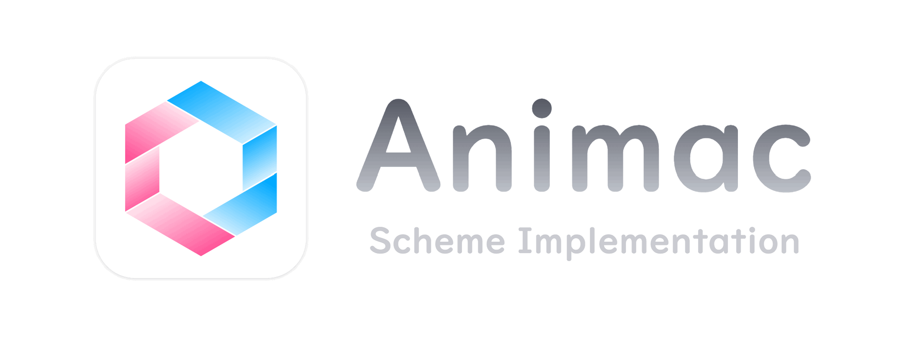

<p align="center"></p>

<h1 align="center">Animac · 灵机</h1>

**灵机 · Animac**是一款[Scheme](https://zh.wikipedia.org/wiki/Scheme)解释器，是Scheme语言的一个实现。Animac能够将Scheme代码编译为中间语言代码，并且在虚拟机上执行中间语言代码。目前，Animac使用TypeScript开发，基于Node.js实现。

## 演示

**案例1**：在Animac的REPL中，通过调用事先封装好的Scheme接口模块`chatbot.scm`，构造提示语（prompt），通过本地宿主环境接口，将其传递给部署于本地的[ChatGLM2-6B](https://github.com/THUDM/ChatGLM2-6B)语言模型，并且将ChatGLM2推理输出的文本回传Animac，实现问答式对话。

https://github.com/bd4sur/Animac/assets/20069428/6fb423b5-7798-41e8-917c-ed828b54ac3e

## 开始使用

请先安装Node.js，建议使用 V18.17.1 LTS。然后执行以下命令，以启动Animac：

```
git clone https://github.com/bd4sur/Animac.git
cd Animac
node build/animac.js -h
```

构建：`npx tsc`

## 系统框图


## 特性

### Scheme语言特性

- 支持Scheme核心子集，包括作为值的函数、词法作用域和列表操作。
- 支持作为值的续体（continuation）和`call/cc`。
- 具备模块机制，可检测并管理模块间依赖关系。

### 运行时系统

- 基于栈的虚拟机，执行Scheme代码编译成的中间语言代码。
- 支持虚拟机层次上的多线程。支持“端口”机制以实现线程间通信。

### 宿主接口和可扩展性

- 提供宿主接口机制，称为“Native接口”，类似于JNI，实现Animac与宿主环境（Node.js）的互操作，例如文件读写、网络收发等。通过Native接口的二次开发，可以灵活扩展Animac的功能，无需修改Animac核心。
- **不打算严格遵守R<sup>5</sup>RS标准**。

## 用例

全部测试用例位于 [`test`](https://github.com/bd4sur/Animac/tree/master/test) 目录，主要包括3个用例集合和两个较大规模的单独的测试用例，详情如下。

用例集1 `test/test_1.scm` 包括：

- 格式化输出日历
- Man or Boy test ([Wikipedia](https://en.wikipedia.org/wiki/Man_or_boy_test))
- 使用CPS风格实现的复杂的阶乘
- 快速排序
- Quine（自己输出自己的程序）
- 准引用列表
- *The Little Schemer* 书中给出的简单解释器
- 中缀表达式解析器
- 生成器
- 快速傅里叶变换

用例集2 `test/test_2.scm` 包括：

- Church encoding ([Wikipedia](https://en.wikipedia.org/wiki/Church_encoding))
- Brainfuck解释器

用例集3 `test/test_3.scm` 包括：

- 线程和本地库（文件、HTTPS）测试
- Yin-yang puzzle ([Wikipedia](https://en.wikipedia.org/wiki/Call-with-current-continuation#Examples))

用例 `test/test_deadlock.scm` 实现了一个死锁现象的案例，旨在测试线程机制和端口操作。

用例 `test/test_tls.scm` 实现了 *The Little Schemer* 书中的部分示例代码。

### 词法作用域

```scheme
(define free 100)

(define foo
  (lambda () free))

(define bar
  (lambda (free)
    (foo)))

(display (bar 200)) ;; 输出100，而不是200
```

### 函数作为一等公民

```scheme
(define eval
  (lambda (f a b)
    (f a b)))

(display (eval * 30 40)) ; 1200
(display (eval (lambda (x y) (/ (+ x y) 2)) 30 40)) ; 35
```

### Quine（自己输出自己的程序）

```scheme
((lambda (x) (cons x (cons (cons quote (cons x '())) '()))) (quote (lambda (x) (cons x (cons (cons quote (cons x '())) '())))))
```

### 续延和`call/cc`

```scheme
;; Yin-yang puzzle
;; see https://en.wikipedia.org/wiki/Call-with-current-continuation

(((lambda (x) (begin (display "@") x)) (call/cc (lambda (k) k)))
 ((lambda (x) (begin (display "*") x)) (call/cc (lambda (k) k))))

; @*@**@***@**** ...
```

## 特性规划

|Features|Priority|Status|
|----|-----|----|
|可视化调试工具|★★★|开发中|
|垃圾回收|★★★|研究中|
|卫生宏和模式匹配|★★★|研究中|
|字符串模板和正则表达式|★★★|开发中|
|完善设计文档和用户手册|★★☆|开发中|
|数值类型塔（数学库）|★★☆|计划中|
|Canvas/SVG图形库|★★☆|计划中|
|R<sup>n</sup>RS尽量兼容|★☆☆|研究中|
|持续集成和自动化测试|★☆☆|计划中|
|较高级的编译优化|★☆☆|计划中|
|用C语言重构VM|★☆☆|开发中|
|自动CPST&自动柯里化|★☆☆|计划中|
|类型系统|★☆☆|计划中|

## 形式语法（BNF表示）

```
    <SourceCode> ::= (lambda () <TERM>*) CRLF
          <Term> ::= <SList> | <Lambda> | <Quote> | <Unquote> | <Quasiquote> | <Symbol>
         <SList> ::= ( <SListSeq> )
      <SListSeq> ::= <Term> <SListSeq> | ε
        <Lambda> ::= ( lambda <ArgList> <Body> )
       <ArgList> ::= ( <ArgListSeq> )
    <ArgListSeq> ::= <ArgSymbol> <ArgListSeq> | ε
     <ArgSymbol> ::= <Symbol>
          <Body> ::= <BodyTerm> <Body_>
         <Body_> ::= <BodyTerm> <Body_> | ε
      <BodyTerm> ::= <Term>
         <Quote> ::= ' <QuoteTerm> | ( quote <QuoteTerm> )
       <Unquote> ::= , <UnquoteTerm> | ( unquote <QuoteTerm> )
    <Quasiquote> ::= ` <QuasiquoteTerm> | ( quasiquote <QuoteTerm> )
     <QuoteTerm> ::= <Term>
   <UnquoteTerm> ::= <Term>
<QuasiquoteTerm> ::= <Term>
        <Symbol> ::= SYMBOL
```

## 关于名称

**Animac**，是自创的合成词，由拉丁语词汇Anima“灵魂”和Machina“机器”缩合而成，寓意“有灵魂的机器”。汉语名称为“**灵机**”，从“灵机一动”而来，也暗示本系统与图**灵机**的计算能力等价。

## 权利声明

版权所有 &copy; 2019~2023 BD4SUR，保留所有权利。

本系统“按原样”提供，采用MIT协议授权。本系统为作者个人以学习和自用目的所创作的作品。作者不对本系统的质量作任何承诺。作者不保证提供有关本系统的任何形式的解释、维护或支持。作者不为任何人使用此系统所造成的任何正面的或负面的后果负责。
